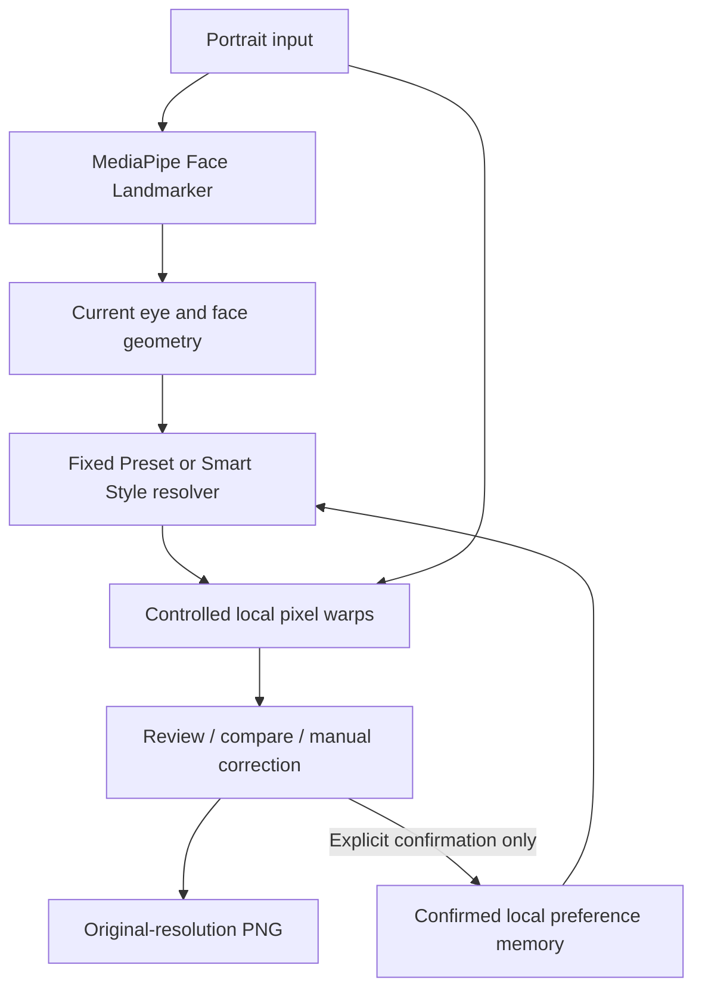

# Product documentation

## Persona, input and output

The user regularly edits portraits and repeats similar personal choices. Inputs are a portrait, explicitly confirmed retouch settings and landmarks detected from the current image. Output is a locally edited portrait, reviewed/corrected by the user and exported as PNG. Current slider movements are temporary until an explicit save/confirmation.

## Architecture

MediaPipe is reused, not trained by this project. It supplies landmarks, not beauty decisions or generated pixels. StyleMe implements the confirmed-memory, adaptation and local warp logic. There is no RAG, agent workflow or generative image model in the editing path.

## Implementation map

`main.js` handles upload, detection and editor state. `eyeWarp.js` / `faceWarp.js` derive usable geometry from the detected landmarks. `eyeWarp.js` / `faceWarp.js` implement bounded inverse mapping with bilinear sampling. `imagePipeline.js` renders from the pristine source; zero strengths restore original pixels rather than undoing prior edits. `displayRectangle.js` computes a single contained display rectangle; `product.js` uses it for the aligned canvases and divider. This changes display size, not processing/export resolution. `exportImage.js` excludes UI and landmarks from PNG output.

`styleProfile.js` saves up to five distinct confirmations, numeric strengths, compact geometry ratios and photo digests. `preferences.js` supports explicit saved settings. Neither stores portraits. `rememberedStyle.js` resolves Fixed Preset or Smart Style: Fixed Preset uses the first confirmed setup photo’s valid strengths unchanged across held-out portraits. Smart Style can adjust eye strength using a robust relationship with eye geometry only when five examples pass range, consistency and leave-one-out checks; otherwise it falls back to the median. It limits adaptation to the supported range. StyleMe Face Slimming uses the five-photo median; Fixed Preset uses the first setup example’s face strength. Both use the existing per-image geometry/safety rules. There is no separate learned face-strength predictor.

`guideSnippet.js` is a simulation with decoded, cached local portrait assets and illustrative values. Its draggable comparison tint illustrates the control; it is not an additional retouch engine and never saves preferences.

## Evaluation and targeted metric

Use five development images and ten held-out images. Freeze rules, profile, acceptance criteria and skip policy before scoring. For each anonymous output, Eye Enlargement and Face Slimming each receive one unit if further adjustment is needed, otherwise zero. Total: 0–2. Target: at least 30% reduction in average correction units versus Fixed Preset on the same evaluable cases. If baseline corrections are zero, percentage reduction is undefined. Report successful case counts out of ten and explicit skips/failures alongside paired aggregates.

The local Evaluation Lab freezes the five-example profile and ten-file digests, randomizes A/B assignment, hides identities until finalization, locks confirmed scores and exports JSON. Version-1 sessions remain eye-only; version-2 sessions use both dimensions with the legacy median baseline; new version-3 sessions freeze the first-example baseline. Existing sessions are not migrated. Local client-side concealment cannot stop source inspection. The author is the evaluator, so bias remains possible.

## Metrics reached

Final version-3 held-out evaluation (baseline: `first-confirmed-example`, scope: Eye Enlargement + Face Slimming), supplied by the author:

- 10 held-out portraits: **4 successfully scored paired cases**, 6 safely skipped, 0 failed.
- Fixed Preset: **7 total corrections**, **1.75 mean corrections per scored image**.
- StyleMe: **3 total corrections**, **0.75 mean corrections per scored image**.
- Reduction: `(7 - 3) / 7 × 100 = 57.1%`, calculated only on the four evaluable paired cases.

The original >=30% target was exceeded within the evaluable subset. This does not demonstrate broad generalization: only 4/10 portraits were evaluable. The six safety skips are excluded from correction means, not counted as successful zero-correction cases.

Safe-skip breakdown: four no-face cases (H01, H02, H04, H08), one unreliable/nearly-closed-eye case (H07), and one eyes-too-small case (H09). No processing failures were recorded.

The setup geometry/preference relationship did not validate. The final StyleMe condition therefore used the five-photo median fallback (Eye 43 / Face 65), versus the first-example preset (Eye 34 / Face 57), subject to unchanged per-image safety rules. The 57.1% reduction is not evidence of geometry-dependent Eye adaptation.

The protocol remained frozen and A/B identities were concealed until finalization; the author remained the evaluator. These author-supplied results are transcribed in [results.csv](evals/results.csv), not independently rerun here. StyleMe reduced manual correction needs on portraits it could safely process, but coverage was limited. In this set, the observed coverage bottleneck was reliable face/eye geometry on smaller or less suitable portraits.

## Practical limits

Single-person portraits and reliable landmarks are required. Pose, occlusion, hair and background near the face can limit natural contour deformation. Geometry safeguards reduce or skip unsafe edits; they do not guarantee artifact-free output. File hashes cannot reliably identify crops or re-encoded duplicates. Five examples and ten held-out photos are a small course experiment, not broad evidence of generalization. Browser storage is origin-specific and can be cleared by the browser/user. Fonts and model assets require network downloads; image processing itself is local with no per-photo AI API fee.

## Confirmed development outcome

The author’s five Eye/Face settings are 34/57, 43/53, 46/65, 47/68 and 43/65. The reported geometry/preference relationship failed the existing validation checks. This valid negative adaptation result is preserved: Fixed Preset uses 34/57, while StyleMe uses median 43/65 unless existing safety rules reduce/skip the effect. These development settings are not held-out evaluation results.
