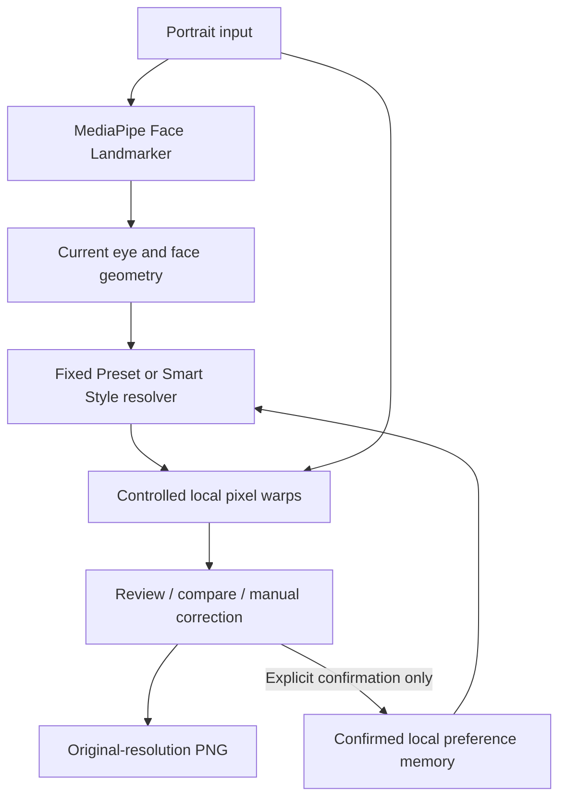

# Product documentation

## Persona, input and output

StyleMe is designed for a user who edits portraits repeatedly and tends to make similar personal adjustments each time.

**Input**
- one portrait
- the user's confirmed Eye Enlargement and Face Slimming settings
- facial landmarks detected from the current image

**Output**
- a locally edited portrait that the user can review, compare, correct and export as PNG

Current slider movements are temporary. A preference is saved only after explicit confirmation.

## Architecture

MediaPipe is a reused component. It provides facial landmarks; it does not decide what looks better and it does not generate the edited image. StyleMe handles the saved preference, safety checks and local retouch logic. The editing path does not use RAG, an agent or a generative image model.

## Main code logic

- `main.js`: upload, detection and editor state
- `eyeWarp.js` and `faceWarp.js`: eye and face geometry plus local retouch operations
- `imagePipeline.js`: renders every edit from the original source image so changes do not accumulate
- `displayRectangle.js`: keeps portrait and landscape previews in the correct aspect ratio
- `product.js`: aligned before/after comparison and divider
- `styleProfile.js`: stores up to five confirmed examples
- `rememberedStyle.js`: resolves Fixed Preset or StyleMe settings
- `preferences.js`: explicit saved settings
- `exportImage.js`: original-resolution PNG export
- `guideSnippet.js`: the illustrated How It Works walkthrough; it is separate from the real editing engine

The saved profile contains numeric edit strengths, compact geometry values and photo digests. It does not store the portrait itself.

## Fixed Preset and StyleMe

**Fixed Preset** uses the first confirmed setup photo's settings unchanged across held-out portraits.

For the final profile:
- Eye Enlargement = 34
- Face Slimming = 57

**StyleMe** uses the five confirmed examples. The five Eye/Face pairs were:

- 34 / 57
- 43 / 53
- 46 / 65
- 47 / 68
- 43 / 65

The median was:
- Eye Enlargement = 43
- Face Slimming = 65

I tested whether Eye Enlargement could adapt to the detected face geometry. The five examples did not show a clear and consistent relationship between geometry and my preferred settings, so I did not force an adaptation rule. The final StyleMe condition therefore used the median confirmed settings.

Both methods keep the same per-image safety checks. If the face or eye geometry is not reliable enough, the edit is reduced or skipped.

## Evaluation and target metric

The final evaluation used:
- 5 development portraits for profile setup
- 10 held-out portraits for final scoring

The rules, profile, acceptance criteria and skip policy were frozen before held-out scoring.

One correction unit means one supported setting still needs manual adjustment after the automatic output:
- Eye Enlargement: 0 or 1
- Face Slimming: 0 or 1

Each scored output therefore has 0–2 correction units.

**Target:** at least 30% fewer average correction units than Fixed Preset on the same evaluable paired cases.

The Evaluation Lab:
- uses the same held-out portrait for both methods
- randomizes the A/B presentation
- hides method identity during scoring
- locks completed scores
- keeps skips and failures separate
- reveals method identity only after finalization
- exports the final session as JSON

The author remained the evaluator, so some subjectivity remains even with concealed A/B identities.

## Metrics reached

Final held-out evaluation:

- 10 held-out portraits
- **4 successfully scored paired cases**
- **6 safely skipped**
- **0 processing failures**
- Fixed Preset: **7 total corrections**, **1.75 mean corrections per scored image**
- StyleMe: **3 total corrections**, **0.75 mean corrections per scored image**
- Relative reduction: **57.1%**

The original 30% target was exceeded within the four evaluable paired cases.

The six skips were:
- H01, H02, H04 and H08: no reliable single face detected
- H07: unreliable / nearly closed eye geometry
- H09: eyes too small to adjust safely

These skipped cases were not counted as zero-correction successes.

The 57.1% result should not be attributed to geometry-based adaptation. That relationship did not validate in the five development examples. The final comparison was therefore the first-example Fixed Preset (34/57) versus the five-example StyleMe median (43/65), with the same safety checks applied to both.

See:
- [Evaluation protocol](evals/evaluation_protocol.md)
- [Case-level results](evals/results.csv)
- [Final evaluation export](evals/final_evaluation.json)

## Practical limits

The current prototype works best with a clear single-person portrait and reliable landmarks. Small faces, closed or unclear eyes, pose, hair and nearby background can make local deformation unreliable.

The evaluation set is small and comes from one person and one graduation-photo series, so it does not show broad generalization.

The interface is available in English, Simplified Chinese and Korean. The editing logic is the same across all three languages.

Portrait processing is local in the browser. There is no paid image-generation API call per photo. Browser/device computation, hosting and external font/model downloads still have costs.
